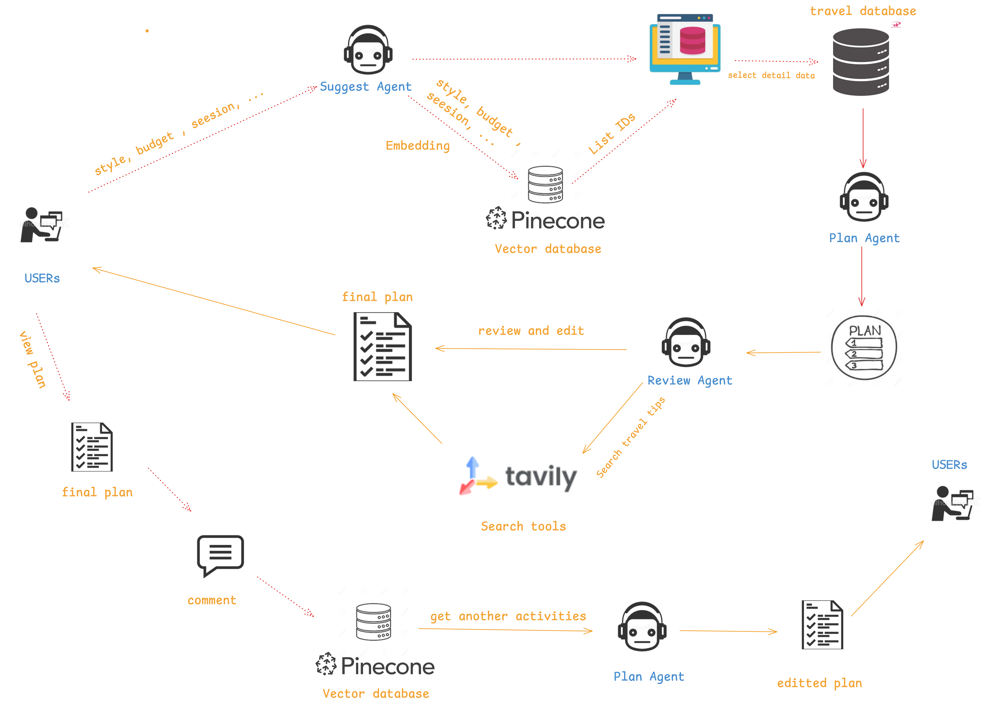

# Trip Planner

A web app that allows users to easily select and customize their tour itinerary based on personal preferences, using either predefined suggestions or AI-generated recommendations.

## Demo

## Installation
[Frontend](./frontend/README.md)

[Backend](./backend/README.md)

[AI](./ai/requirements.md)

### Frontend
- **Framework**: React 19 with TypeScript
- **Build Tool**: Vite
- **UI Library**: Ant Design
- **Routing**: React Router v7
- **Styling**: TailwindCSS v4
- **API Integration**: Axios
- **Drag and Drop**: React DnD
- **Other Libraries**: html2canvas (for screenshots), xlsx (for spreadsheet exports)

### Frontend Architecture
- **Single Page Application (SPA) Structure**:
  - React Router for client-side routing with BrowserRouter
  - Main app shell with conditional rendering based on active tab
  - Two main sections: Travel Planning (create new plans) and Travel List (view existing plans)
  - Nested routing for detailed plan views
  - Clean component separation with modular feature-based organization

- **Component Structure**:
  - **Auth System**: Sign In/Sign Up components with token-based authentication
  - **Travel Planning Flow**: Multi-step interface with the following steps:
    - Destination selection
    - Budget and people configuration 
    - Travel dates/time selection
    - Personal preferences input
    - AI-powered plan generation
  - **Plan Management**:
    - List view with tabs (Upcoming, Ongoing, Completed, All)
    - Detailed plan view with day-by-day itinerary
    - Drag and drop functionality for reordering activities
    - Expense tracking and bill splitting features
    - Export to spreadsheet capability

- **API Integration**:
  - Centralized API client with axios and interceptors
  - Token-based authentication with automatic expiry handling
  - Custom fetch hooks using useState and useEffect for data fetching

## Activity Diagram

## Database schema

## AI agent schema

### Agent Workflow Script

1. **User Input**: Users provide preferences (style, budget, session, etc.).
2. **Suggest Agent**: Receives user input, generates embeddings, and queries Pinecone (vector database) for relevant travel options.
3. **Pinecone**: Returns a list of IDs matching the user's preferences.
4. **Plan Agent**: Fetches detailed data from the travel database using the list of IDs, then creates a draft plan.
5. **Review Agent**: Reviews and edits the draft plan, searches for travel tips using Tavily (search tools), and finalizes the plan.
6. **User Review**: Users can view, comment, and request edits to the plan.
7. **Plan Agent (Edit)**: Incorporates user feedback, fetches additional activities if needed, and updates the plan.
8. **Final Plan**: The final plan is delivered to the user and stored for future reference.

**Key Components:**

- **Suggest Agent**: Embedding and initial recommendation
- **Plan Agent**: Data retrieval and plan creation/editing
- **Review Agent**: Plan review, enrichment, and finalization
- **Pinecone**: Vector database for fast similarity search
- **Tavily**: External search for travel tips and enrichment
- **Travel Database**: Source of detailed travel data
- **User Feedback Loop**: Continuous improvement via user comments and edits
